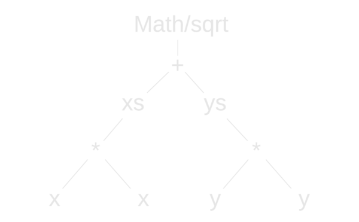
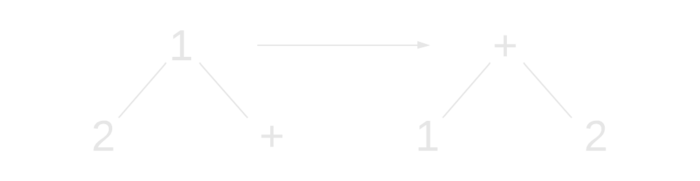

class: center, middle, inverse
layout: true

---

# Generating interactive narratives
Slides: [cblop.github.io/hci-seminar-2014](https://cblop.github.io/hci-seminar-2014)

<!-- punch and judy image -->

---
layout: false
# Sysemia Ltd

- EngD is at Bath/Sysemia ltd
- Background in Aerospace, knowledge management
- Specialists in Semantic Web
- Diversifying into media

---

# Clojurescript: what is it?

- Compiles to Javascript
- Dialect of Lisp (Clojure)
- Can use JS libraries
- Uses Google's closure (not Clojure) compiler

---
class: center, middle, inverse

# What's Clojure, then?

---
# Clojure

- It's a dialect of Lisp
- It runs on the JVM (Java Virtual Machine)
- Can use Java libraries
- Encourages *immutable* data structures
- This makes it ideal for concurrency
- Very simple syntax

---
class: inverse
# Clojure example

    (defn my-function [x y]
        (let [xs (* x x) ys (* y y)]
            (Math/sqrt (+ xs ys))))

---

class: inverse
# Clojure example

    (defn my-function [x y]
        (let [xs (* x x) ys (* y y)]
            (Math/sqrt (+ xs ys))))

    var my-function = function(x, y) {
        var xs = x * x;
        var ys = y * y;
        return sqrt(xs + ys);
    }

---
class: center, middle, inverse

# It's a tree!

---

class: center, middle, inverse

# Syntax time!

---
class: center, middle, inverse

# What macros do

---

# Light Table

- A new editor written in Clojurescript
- Inspired by a talk called "[Inventing on Principle](vimeo.com/36579366)" by Bret Victor
- Built for "live coding"
- In very early alpha
- Also supports JS, Python (right now), but is designed for Clojure(script)
- Supports source maps!

---
class: center, middle, inverse

# Let's make a game!

---

# CLJS Live Game Demo

- This demo was made by Chris Granger, creator of Light Table
- Play with it online at [bristolclojure.herokuapp.com](http://bristolclojure.herokuapp.com)
- Hack at the code: [github.com/cblop/live-cljs](https://github.com/cblop/live-cljs)

---

# Challenges

- Change the colours of the ball and blocks
- Change the ball to something else
- Make the ball (or whatever) shoot lasers
- ...etc

---
class: center, middle, inverse

# Now for something a bit more advanced

---

# Entity-Component-System

- Composition instead of inheritance
- Attempts to avoid complex class hierarchies
- Defines functionality through separate components
- Each game object is defined by a bunch of components

---

# Entity-Component-System

- Entity: just a unique ID and a list of components
- Component: describes a piece of behaviour/appearance/functionality. Only holds data, no methods
- System: kind of like a draw/update loop, but runs on every entity with a matching component to that system

---

# Example: collision detection

- Entities: a bunch of unique IDs with components
- Components: (e.g physical and visible)
- System: iterates through all entities that have a physical component, detects collisions, generates events
- Other examples: drawing, damage, sound, etc

---

# Chocolatier game engine

- Clojurescript running the pixi.js rendering engine
- Entity-Component-System design
- [github.com/alexkehayias/chocolatier](https://github.com/alexkehayias/chocolatier)

---

# Challenges

- get it running!
- live update the bunny's speed
- change the bunny to something else
- implement ground, gravity
- get the bunny to jump

---

class: middle, inverse

# Questions

- Slides online at [cblop.github.io/clojure-dojo-1](https://cblop.github.io/clojure-dojo-1)
- Web: [bristolclojurians.org](http://bristolclojurians.org)
- Group: [https://groups.google.com/forum/#!forum/bristolclojurians](https://groups.google.com/forum/#!forum/bristolclojurians)
- Twitter: [@BristolClojure](http://twitter.com/BristolClojure)
